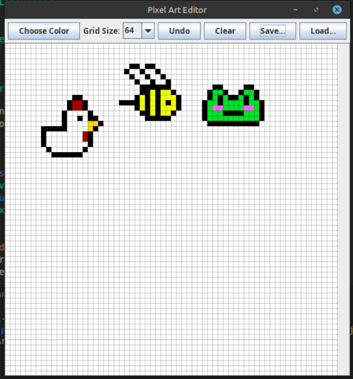
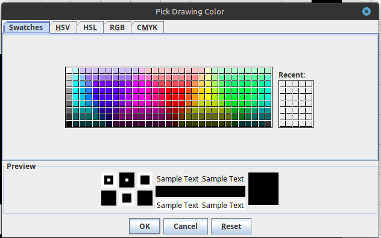

# 🎨 Pixel Art Editor - Java Swing Application

A lightweight, beginner-friendly **Pixel Art Editor** built using Java Swing. This project lets users draw, color, undo, save, and load pixel art with ease — perfect for retro-style art or educational purposes.

---

## ✨ Features

- Adjustable grid size (8×8 to 128×128)
- Color picker for easy selection
- Right-click to erase (draw with white)
- Undo and Clear options
- Save pixel art as a **centered full-screen image**
- Load external PNGs and convert them to pixel grid
- Smooth drawing with nearest-neighbor interpolation

---

## 🖼️ Screenshots

### 🖱️ Main Drawing Interface
Launch the application and start creating!


### 🌈 Color Picker in Action
Choose any color to draw with using the integrated color picker.


---

## 🧰 How to Use

### 🔧 Run the Application

1. Make sure Java (8 or higher) is installed.
2. Compile the file:

   ```bash
   javac PixelArtEditor.java
   ```

3. Run it:

   ```bash
   java PixelArtEditor
   ```

### 🖌️ Controls

- **Left-click** to draw
- **Right-click** to erase
- **Choose Color** to change brush
- **Grid Size** to reset canvas with a new grid
- **Undo** to revert your last step
- **Clear** to start fresh
- **Save** exports your art centered on a screen-sized white canvas
- **Load** imports a PNG and fits it to your grid

---

## 💾 Save Format

Saved PNGs are exported at full screen resolution with your pixel art centered and scaled using **nearest-neighbor** to preserve crispness.

---

## 🙌 Made With

Java Swing, AWT, and a lot of ❤️ for pixel art.

---

## 📜 License

This project is open-source and available under the [MIT License](LICENSE). Feel free to fork, learn, or contribute!
